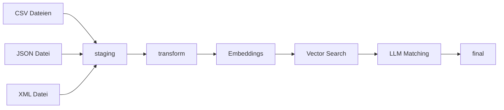

# Big-Brain-Energy

Szenario B – VetKliniken-Verbund (AI Matching)

## Fallstudie Datenmanagement


### Team

- Veronika Getmann
- Arne Chris Müller
- Tracy Adams

---

## Projektübersicht

Im Rahmen der Fallstudie wird eine Datenintegrationspipeline für einen Verbund von Tierarztpraxen entwickelt.

Für Szenario B wird ein AI-gestützter Ansatz verfolgt:

- Extract der Quelldaten
- Staging in DuckDB
- Embedding-Erzeugung
- Vector Search
- LLM-basiertes Matching
- Golden Record Bildung

## Architektur



## W7

Erstellt wurden:

- Profiling-Reports
- Data Dictionary
- Fehlerliste

Verzeichnis:

```text
docs/w7_profiling/
```

---

## W8

Erstellt wurden:

- Extract-Skripte
- Staging-Schicht in DuckDB
- Zeilenstatistik

### Ausführung

```bash
python3 load_all_to_duckdb.py
```

### Ergebnis

Die Pipeline erzeugt die Datenbank:

```text
profiling.duckdb
```

mit dem Schema:

```text
staging
```

### Staging-Tabellen

```text
staging.juck_kunden
staging.juck_behandlungen

staging.wald_kunden
staging.wald_behandlungen

staging.schm_kunden
staging.schm_behandlungen

staging.berg_patienten
staging.berg_behandlungen
```

Jede Tabelle enthält zusätzlich:

```text
quell_zeile
quell_datei
```

zur Nachverfolgbarkeit der Herkunft.

### Zeilenstatistik

| Tabelle | Zeilen |
|----------|---------:|
| staging.juck_kunden | 223 |
| staging.juck_behandlungen | 150 |
| staging.wald_kunden | 227 |
| staging.wald_behandlungen | 150 |
| staging.schm_kunden | 234 |
| staging.schm_behandlungen | 150 |
| staging.berg_patienten | 232 |
| staging.berg_behandlungen | 150 |

Die vollständige Statistik befindet sich in:

```text
docs/w8/w8_zeilenstatistik.csv
```

### KI-Komponenten

Für die spätere Dublettenerkennung werden vorbereitet:

- Ollama lokal installiert
- qwen2.5:7b installiert
- nomic-embed-text installiert
- create_embeddings.py erstellt
- Embeddings erzeugt
- DuckDB VSS aktiviert
- HNSW Vector-Index erstellt

---
## W9

Erstellt wurden:

- `transform.norm_kunde`
- `transform.norm_behandlung`
- Embeddings auf Basis der transformierten Kundendaten
- Vector Search mit DuckDB VSS
- LLM-basiertes Matching mit `qwen2.5:7b`
- Pydantic-Schema für strukturierte Entscheidungen
- Review Queue für unsichere Fälle
- Evaluation gegen `gold_cluster.csv`

### Transform-Schicht

Erstellte Tabellen:

```text
transform.norm_kunde
transform.norm_behandlung
```

### Matching-Pipeline

```text
transform.norm_kunde
        ↓
Embeddings (nomic-embed-text)
        ↓
DuckDB VSS / HNSW
        ↓
Vector Search
        ↓
LLM Judge (qwen2.5:7b)
        ↓
Pydantic Schema
        ↓
transform.ai_matches
```

### Evaluation

| Kennzahl | Wert |
|-----------|------:|
| Precision | 0.4809 |
| Recall | 0.4375 |
| F1 | 0.4582 |

### Prompt- und Threshold-Kalibrierung

Getestete Prompt-Versionen:

- `match_prompt_v1.txt`
- `match_prompt_v2.txt`

Getestete Similarity-Thresholds:

| Threshold | F1 |
|-----------|---:|
| 0.95 | 0.4113 |
| 0.90 | 0.4582 |

Der Threshold 0.90 erzielte den höheren F1-Wert und wurde für die weitere Pipeline übernommen.

### Dokumentation

Detaillierte Ergebnisse:

```text
docs/w9/w9_ergebnis.md
```

---

## Nächste Schritte (W11)

- Weiterentwicklung der Matching-Pipeline
- Optimierung von Prompt und Threshold
- Verbesserung von Precision, Recall und F1
- Clusterbildung aus Dublettenpaaren
- Golden-Record-Erzeugung
- Aufbau von `final.verbund_kunde`
- Aufbau von `final.verbund_behandlung`
- Vollständige Verbund-Datenbank
- Abschlussdokumentation